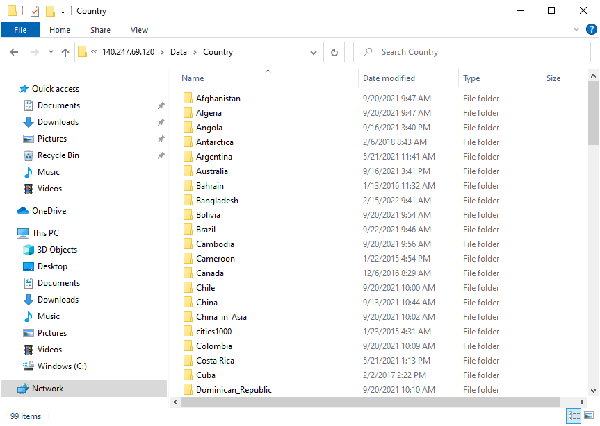
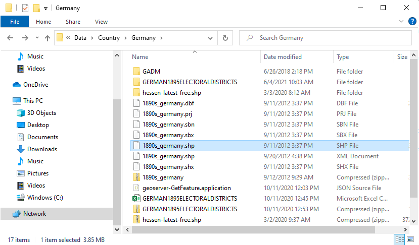
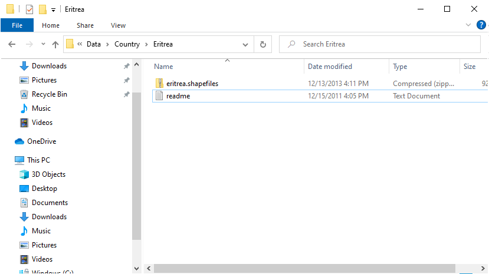
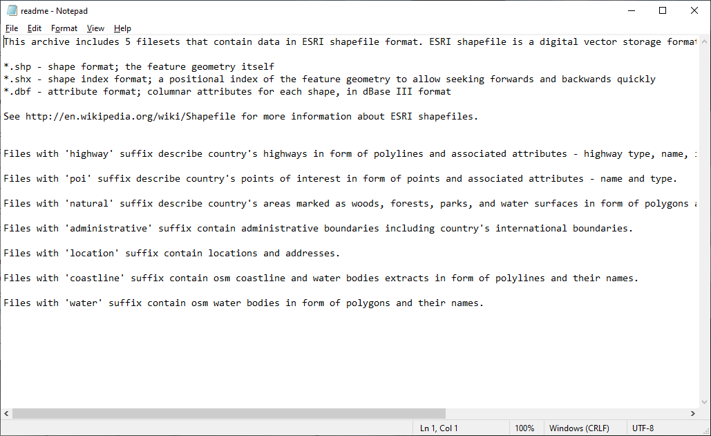
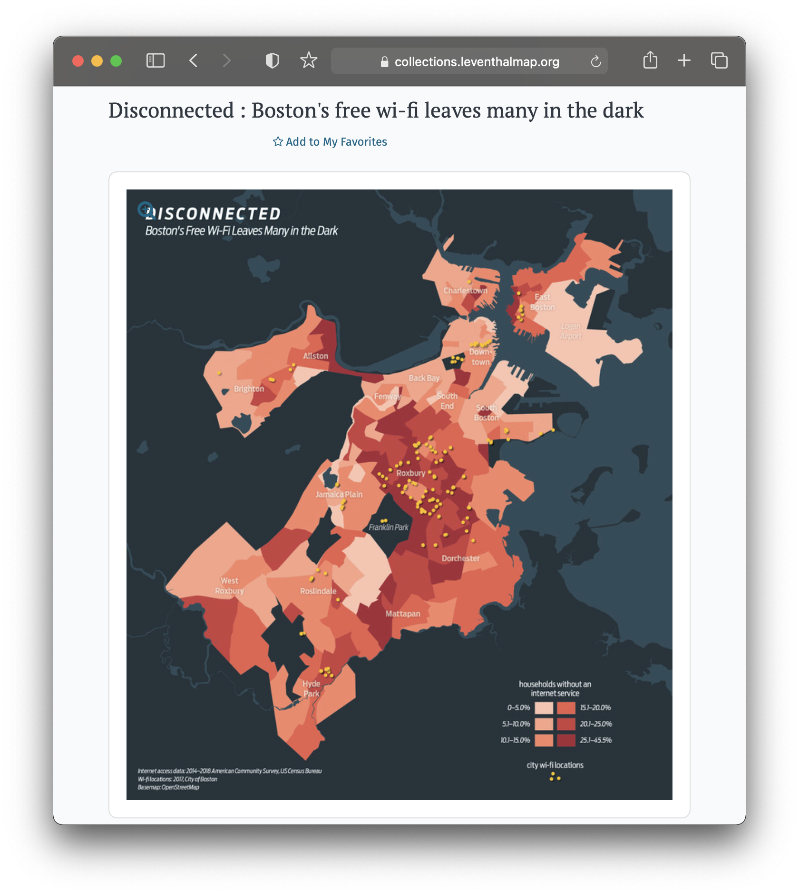
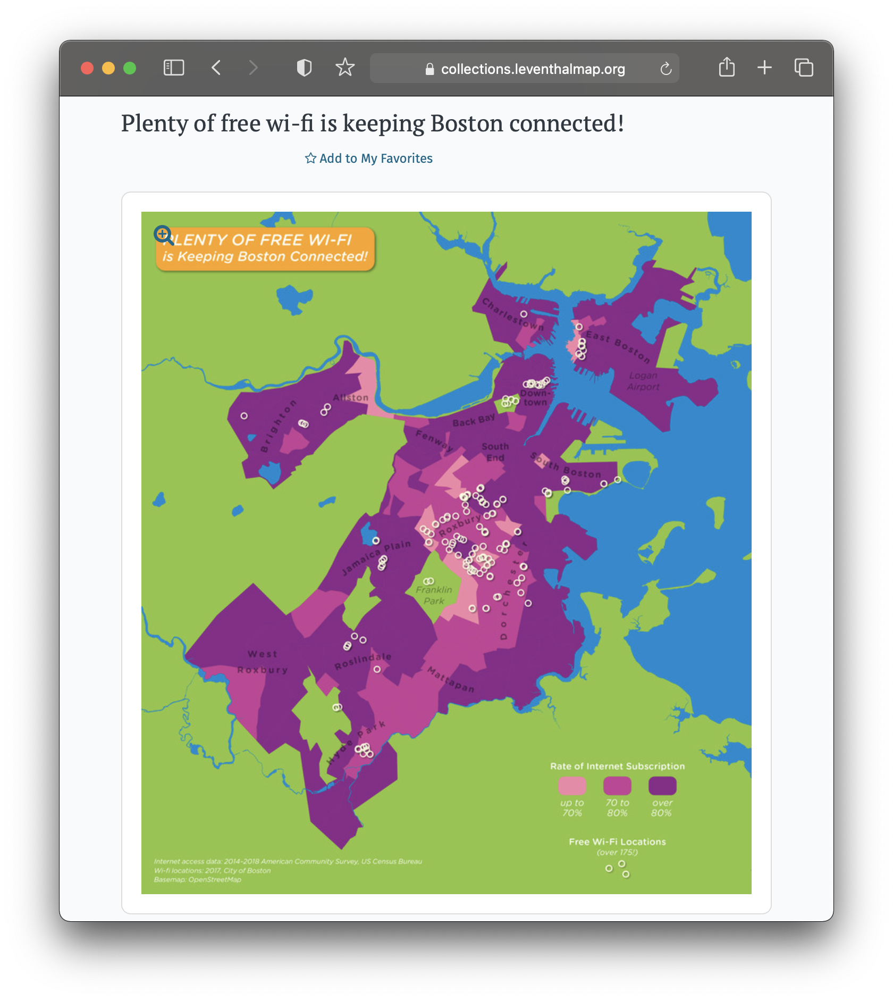
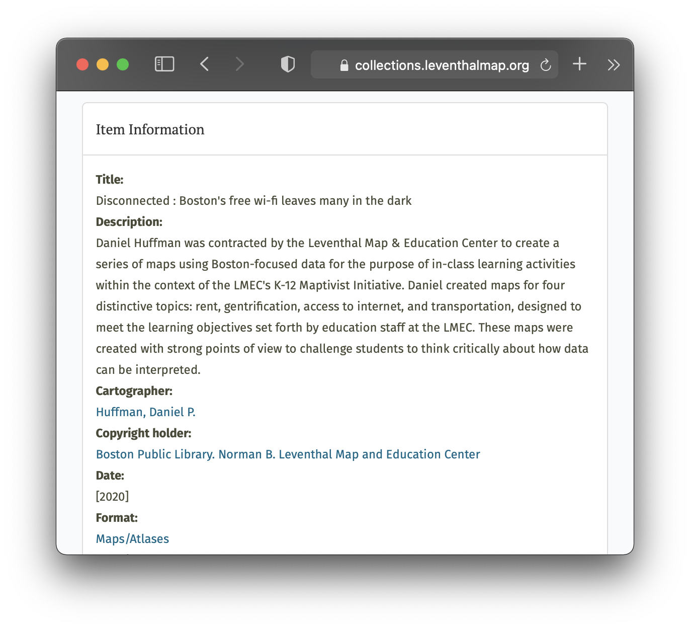
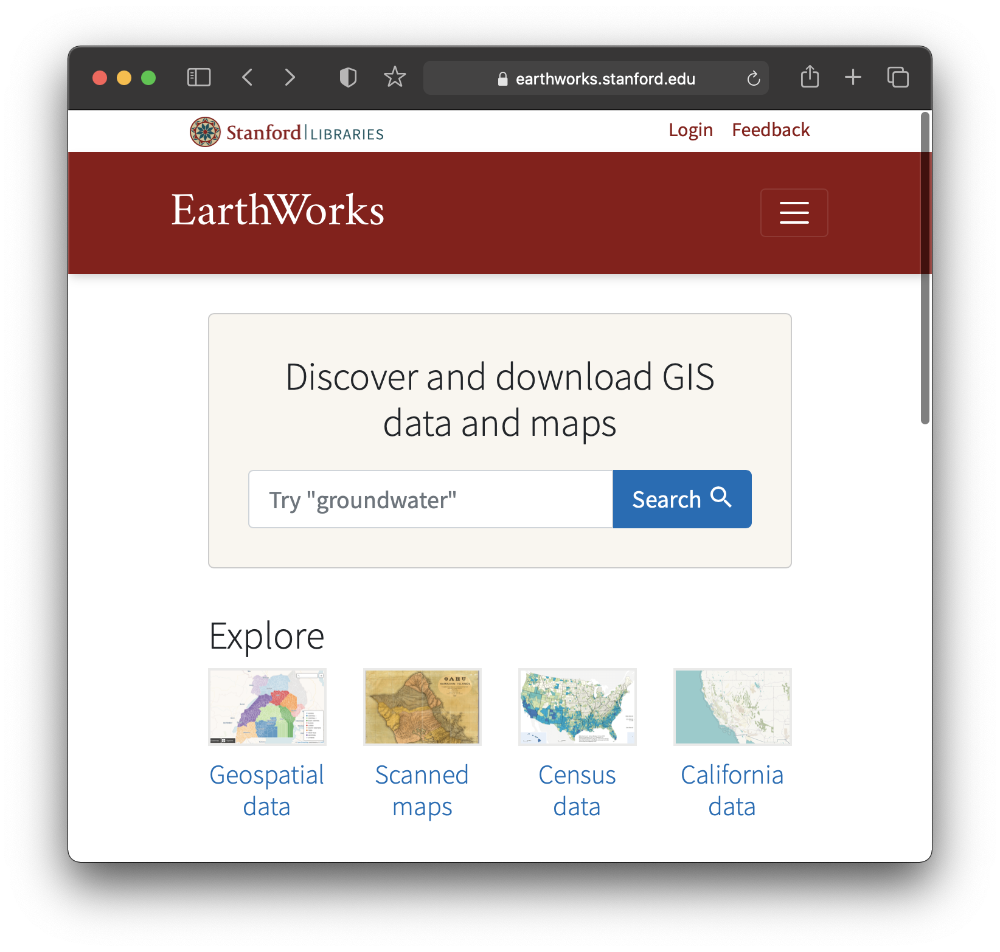
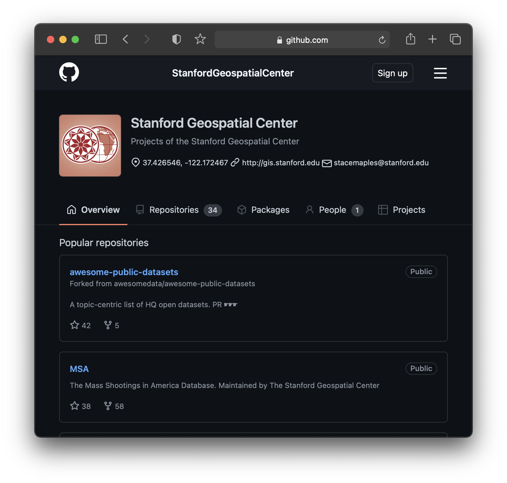

# Creating Usable Data

### Explicit motivations

_[Map](https://digitalcollections.library.harvard.edu/catalog/990096776380203941) illustrating the proposed system of standard time as reported to the General and Southern Railway Time conventions, 1883._

### How much context?

### Useful context

### Publishing data

Institutional Repository      |  Github
:-------------------------:|:-------------------------:
  |  

## Activity 

### Resources
- [Political Movement in Lahore](https://archive.lums.edu.pk/interactives/anti-ahmadi-1953/background)
- [Mapping Inequality](https://dsl.richmond.edu/panorama/redlining/#loc=5/39.1/-94.58)
- [Black Philadelphia 1800-1850](https://www.google.com/maps/d/u/0/viewer?mid=11DSHFLWY7SuXvOg-t6pBXyclncNgI20v&ll=39.94897629046434%2C-75.1445722047311&z=13)

### Questions

1. How do I download the data?
2. How did people create this data, and where did they get their sources?
3. How did the creators choose what is included in the dataset(s)? 
4. If I wanted to contribute to or repurpose this dataset, how would I start?

## Metadata template
Recommended [information to fill out](https://github.com/HarvardMapCollection/DIY-metadata) as you are creating or editing GIS data for your project.

## Questions

To get in touch with Belle, you can email her at belle_lipton@harvard.edu.

