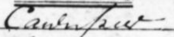
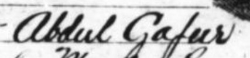

# Gathering Data: Indian Indentured Laborers in Fiji

### An opening exercise

Consider this quote:  
> I arrived in Fiji in 1910. With others we were sent to Lautoka which we reached on a night when hurricane winds were raging. Our first night there was spent in the Lautoka mill. There, the next day, we were separated and distributed to the various plantations.
> 
> I went to Koronubu. There the kitchen was some distance from where the lines were and there was no place for bathing. We had to use the riverside for washing ourselves. On arrival at Koronubu we were given our foodstuffs to cook and on the next day the various tools with which we were going to work.   

Brainstorm how we might begin gathering data from this quote from an indentured laborer in Fiji. 

Consider:  
- What is interesting about this quote? How might we visualize it?  
- What type of data could we gather from it?  
- In what ways is this data incomplete // what would we need to supplement it?  
- How might we approach tackling a project using this source? 

## 1. Immigration Pass Data

#### 1.1 Open to the first record.  

If you haven't yet done so, download the National Library of Australia's file of [Indian immigration passes for the Sangola V](https://nla.gov.au/nla.obj-2827481662), which arrived in Fiji on March 7, 1910.
    
#### 1.2 Let's briefly familiarize ourselves with the format. 
Each page is a single pass for an individual traveling from India to Fiji. 

At the top of the page, someone has handwritten the immigration pass number.  
The very first one here is immigration pass "40077"

The form includes space for details about the individual:  
  - name 
  - father's name  
  - age  
  - caste

**What other data does the form collect about each individual?** 
**Does any of it surprise you?**

I'm curious about where recruiting was happening in 1910. I'm wondering indenture recruitment patterns correspond with areas hardest hit by the last famine. 

I hypothesize that young men are more vulnerable to indenture when they come from areas with a recent history of precarious food supplies.

## 2. Gathering Data  

#### 2.1 Open a basic text editor. 

For Windows this may Notepad or TextEdit for Mac. DO NOT USE Microsoft Word. You can also use an editor like [Atom](https://atom.io/) if you already have it installed.

#### 2.2 Begin transcribing data.
**Only** the **first line** of your text editor, enter the following data from the first page:  
- immigration pass number, 
- the place of registration, 
- name, 
- father's name, 
- age, 
- caste, 
- district

If it is difficult to make out any letters or words, that's okay!

It can be hard reading someone else's handwriting, especially from a different time period and region. Learning to read different old handwriting is called [paleography](https://www.nationalarchives.gov.uk/palaeography/). Different languages, unfamiliar names/terms, spelling variations, and abbreviations can all make it more tricky.  Check out this table showing [handwritten nicknames and appreviations](https://www.startresearching.com/handwriting) for men's names in the 1790 US Census made by geneaologist Sherri Mastrangelo:

After time, even printed texts may become distorted or faded. And in this case, we aren't even examing the original documents. We are looking at a digital duplicate of a microfilm duplicate.[^1] 

[^1]: The original documents are held in Suva at the [National Archives of Fiji](https://en.wikipedia.org/wiki/National_Archives_of_Fiji). In 1991, microfilm duplicates were made and stored at the [National Library of Australia](https://www.nla.gov.au/)... who digitized them recently, allowing researchers like us to access them anywhere with an internet connection! Check out this short article to learn more about microfilm and microfiche: ["Microfiche Was the Dawn of Multimedia Research"](https://edtechmagazine.com/higher/article/2017/05/microfiche-was-dawn-multimedia-research) 

All this is to say: it can be a challenge! You will get better with time. For now you can take your best guess or ask a friend's opinion. Even professional historians get help from colleagues, librarians, and [the internet](https://twitter.com/bathnesbro/status/1197872017720184832)...

Here's how I transcribed each field for the first page. 

| field | form entry | transcription attempt |
| --- | --- | --- |
|  immigration pass number  |   | 40077  |  
| place of registration |  | Cawnpore |   
| name |  | Abdul Gafur |    
| father's name  |  | Maula But |   
| age |  | 20 |   
| caste |  | Musalman |   
| district |  | Alwar |   

How'd I do? Is it different from what you got? Compare with folks around you.

#### 2.3 Structure the data.

We want to turn this into a csv ([comma-separated values](https://en.wikipedia.org/wiki/Comma-separated_values)) file, which is a type of file that stores **tabular data** as plain text. 

Save your file as **"immigration_passes_fiji.csv"**

The ".csv" addition is important in denoting this as a comma-separated value file. 

In order for the file to tabulate the data, we will need to separate the values with commas. 

Insert a comma between each piece of information and **remove any extra spaces** after the commas. Remember: keep everything on one line. Now, your file should look like this:

    40077,Cawnpore,Abdul Gafur,Maula But,20,Musalman,Alwar

Now hit **enter** to start a new line.

#### 2.4 Resume transcription.  

Following this structure, transcribe a few more pages.

Remember: start a new line every time you start a fresh page.

**Save your work often!** I make it a habit to save after every single line using CTRL+S (or Command+S)

After a while, your file will begin to look something like this:

    40077,Cawnpore,Abdul Gafur,Maula But,20,Musalman,Alwar
    40078,Agra,Abdul Karim,Jangi Khan,18,Musalman,Dholput
    40079,Ghazipur,Abdul Rahman,Miran,19,Musalman,Ghazipur
    40080,Mutha,Ajodhi,Praldis,14,Thakur,Agra
    40081,Gorakhpur,Ajodhia,Saktu,24,Kari,Basti
    40082,Lucknow,Ali Raza,Ummar,20,Pathan,Gonda
    40083,Cawnpore,Amarnath,Bihari,19,Kahar,Gonda
    40084,Agra,Amir Baig,Mohamed Baig,18,Musalman,Jaipur

## 3. Geocode Data.

#### 3.1 Open data in spreadsheet
It's often useful to manipulate this data in a spreadsheet. You have two options for how you can get this data there. One option is to open the csv file in a spreadsheet (the default way that computers open csv files), or to copy and paste from your text editor into a spreadsheet. In Excel, you can then highlight the column with your data, click on the data tab and then click Text to Columns. Either way you should now have your data organized in rows and columns.

#### 3.2 Organize data in a spreadsheet.  
Insert a row at the top to insert header categories:

    pass_number,registration_place,name,name_father,age,caste,district,ship,date_arrival,lat,lon

Next, we'll fill the ship column. In the top box under the ship label (H2), type "Sangola V". Click H2 and drag down to H9 (this should fill all your used lines) and click CTRL+D (or Command+D), to fill down. Now all the boxes say "**Sangola V**".

Since I already told you that the ship arrived in Fiji on March 7th, 1910, enter the date in cell I2 using this format: **YYY-MM-DD**. Hit enter.

If the contents of your cell changed when you hit enter, try changing selecting the cell and then changing the format from "Date" to "Text"

Now modify your data so that under date_arrival, each entry reads "**1910-03-07**"

Before proceeding, make sure your table looks like this:

#### 3.3 Set up Geocoder.
Go to [GPS Visualizer Geocoder](https://www.gpsvisualizer.com/geocoder/).

Near the top, there is a green text box that alerts you that you'll need your own free API to use this tool. You can use mapquest or bing. DO NOT USE GOOGLE. Take a minute and follow the directions to get an API key and save it -- you will use it again. (I email it to myself with the subject line "bing API code")

Near the top, there is a green text box that alerts you that you'll need your own free API to use this tool. You can use mapquest or bing. DO NOT USE GOOGLE. Take a minute and follow the directions to get an API key and save it -- you will use it again. (I email it to myself with the subject line "bing API code")

Once you have your code, copy and paste it into the API code area on GPS Visualizer. 

#### 3.4 Geocode data.
Go back to your spreadsheet and select the districts the individuals came from [G2:9]) to copy/paste to the input box on GPSVisualizer.

Adjust the other fields as follows:  
- **Type of Data**: Select "raw list" if you did not include headers [G2:9] or "Tabular" if you did include headers [G1:9]. It will alert you/error out if you choose the wrong one.
- **Source**: Either Bing or Mapquest, whichever corresponds to your API code.
- **Field Separator**: Comma
- **Add a color**: leave blank
- **Include source+precision info in output**: check box
- **Insert API key in the box.**

Click "**Start Geocoding**" (note if you make an error, click "cancel geocoding" if you'd like to end the process and "clear results box" to start fresh below).

You should now see "**Results as text**" filled with results. 

#### 3.5 Create preliminary map of your data.
You can click "**Draw a Map**" to see how these plots are laid on a map

_Great job! In the next session we'll work on how to check these results, clean the data up, and add it to our existing csv file._[^2]

[^2]: This lesson adapts and expands on [Lindsey Passenger Wieck](https://lindseywieck.org/)'s tutorial using 1907 San Franisco phone books. 
